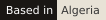
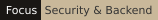
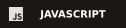
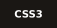
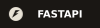
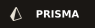
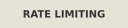
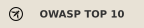

<!-- ============================================================= -->
<!--                     VXL · Hamza · hamzavxl                    -->
<!--        Security-Focused Fullstack & Backend Engineer          -->
<!--        Theme: warm monochrome "stealth" (ink + cream)         -->
<!-- ============================================================= -->

  <!-- Custom terminal banner -->
  

    

  <!-- Animated typing intro -->
  

   

  

    
    &nbsp;
    
    &nbsp;
    
    &nbsp;
    
  

---

### `$ whoami`

<table border="0" width="100%">
  <tr>
    <td width="64%" valign="top">
      

        I'm <b>Hamza</b> — known online as <b>VXL</b>. A security-conscious
        <b>Fullstack &amp; Backend Engineer</b> who architects robust systems and ships
        scalable, production-ready applications.
      

      

        My edge is building software that's <b>secure by design</b> — encrypted request
        flows, hardened authentication, DDoS mitigation, and zero-trust architecture.
        I work primarily across the <b>Python</b> and <b>Next.js</b> ecosystems, and I lean on
        <b>AI-assisted engineering</b> to move fast without sacrificing clean, high-performance code.
      

      <ul>
        <li><code>[+]</code> &nbsp;<b>Secure backends</b> — encryption, rate-limiting, OWASP-hardened APIs</li>
        <li><code>[+]</code> &nbsp;<b>Data integrity</b> — PostgreSQL, Prisma &amp; Drizzle, safe migrations &amp; pooling</li>
        <li><code>[+]</code> &nbsp;<b>AI-assisted engineering</b> &amp; autonomous agent systems</li>
        <li><code>[+]</code> &nbsp;<b>Fullstack delivery</b> — Next.js apps engineered end-to-end</li>
      </ul>
    </td>
    <td width="36%" align="center" valign="middle">
      
    </td>
  </tr>
</table>

---

### `$ cat tech-stack.md`

  
<b>Languages</b>

  

    
    
    
    
    
  

  
<b>Backend</b>

  

    
    
    
    
    
  

  
<b>Frontend</b>

  

    
    
  

  
<b>Databases &amp; ORMs</b>

  

    
    
    
  

---

### `$ ./security --audit`

  
<i>Security isn't a feature I bolt on — it's the foundation I build from.</i>

  

    
    
    
    
    
    
  

---

### `$ ls -la ~/projects`

<table border="0" width="100%">
  <tr>
    <td width="50%" valign="top">
      
<b>▸ Secure E-Commerce Platform</b> 
      High-traffic store, hardened against the OWASP Top 10 with payload encryption and pooled sessions. 
      <code>Express.js</code> · <code>Next.js</code> · <code>PostgreSQL</code> · <code>Drizzle</code> · <code>Helmet.js</code>

    </td>
    <td width="50%" valign="top">
      
<b>▸ VXL-AGEINT — Autonomous AI Agent Layer</b> 
      Sandboxed tool-execution engine with zero-trust permission models blocking unauthorized command &amp; file access. 
      <code>Python</code> · <code>AI Tooling</code> · <code>Sandboxing</code> · <code>Zero-Trust</code>

    </td>
  </tr>
  <tr>
    <td width="50%" valign="top">
      
<b>▸ Automotive Services Web App</b> 
      Responsive fullstack app with secure API routes and optimized DB indexing for faster response times. 
      <code>Next.js</code> · <code>JavaScript</code> · <code>REST APIs</code>

    </td>
    <td width="50%" valign="top">
      
<b>▸ Scalable Backend Service</b> 
      Request validation and secure token-based authentication built to scale. 
      <code>Python</code> · <code>Express</code> · <code>JWT</code>

    </td>
  </tr>
</table>

---

### `$ git log --graph`

  

    

  <!-- Contribution snake — auto-generated by .github/workflows/snake.yml (appears after your first push + Action run) -->
  

---

### `$ curl vxl --connect`

  
  &nbsp;
  
  &nbsp;
  

---

  <code>// secure by design · engineered to last</code>
    
  from <b>VXL</b> — thanks for stopping by.

